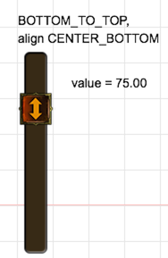

#Quick-Cocos2d-x UI控件之滑动条(UISlider)控件

滑动条控件也叫轨道条控件，它有一条轨道和可以滑动的块。滑动条能与用户交互，通过图像量化的方式改变底层逻辑的数值。

我们来看看具体的滑动条，如下图：




Quick 中的 UISilder 控件支持水平或竖直方向显示。它还支持控件事件。比如 按下、释放、按钮状态变化、取值变化等事件。源码位于`framework/cc/ui/UISlider.lua`。

## 创建

在 Quick 中使用`cc.ui.UISlider.new(direction, images, options)`方法创建一个新的进度条。参数如下：

- direction，number类型，滑动的方向
	- display.LEFT_TO_RIGHT，左右滑动
	- display.TOP_TO_BOTTOM，上下滑动
- images，table类型，
	- bar string类型，滑动条图片资源路径
	- button string类型，滑块图片资源路径
- options，table类型，可用的参数有:
	- scale9 boolean，图片是否可缩放
	- min  number，最小值 默认是0
	- max number，最大值 默认是100
	- touchInButton boolean，是否只在*触摸在滑动块上*时才有效，默认为true。

**示例：**

在 MainScene 的 ctor 方法中加入下面代码：

```
	UISliderTestScene.SLIDER_IMAGES = {
	    bar = "slider/SliderBar.png",
	    button = "slider/SliderButton.png",
	} -- 指定滑动控件的滑动条图片和按钮图片

    local barHeight = 40
    local barWidth = 400
    local valueLabel = cc.ui.UILabel.new({text = "", size = 14, color = display.COLOR_BLACK})
        :align(display.LEFT_CENTER, display.left + barWidth + 60, display.top - 60)
        :addTo(self) -- 添加Label 显示滑动条的取值
    cc.ui.UISlider.new(display.LEFT_TO_RIGHT, UISliderTestScene.SLIDER_IMAGES, {scale9 = true})--新建一个滑动条控件
        :onSliderValueChanged(function(event) -- 滑动滑块数值变化回调
            valueLabel:setString(string.format("value = %0.2f", event.value))
        end)
        :setSliderSize(barWidth, barHeight) -- 设置滑动条大小
        :setSliderValue(75) --设置滑动控件的取值
        :align(display.LEFT_BOTTOM, display.left + 40, display.top - 80) -- 指定对齐方式和坐标
        :addTo(self)
```

上面代码创建了一个水平方向的滑动控件和一个显示滑块值的 Label。

## 修改滑动条大小

当创建参数设置了 scale9 为 true，那么可以通过下面的接口来改变控件的大小。

```lua
UISlider:setSliderSize(barWidth, barHeight)
```

> 如果 scale9 为 false，调用这个接口会报错，程序停止运行。

## 滑动块位置

假如我们提供一个滑动条来改变系统音量，那么控件初始化后，应该能正确显示当前音量的大小。通过下面的接口设置初始位置。

```lua
UISlider:setSliderValue(value)
```

value 的 取值范围 [options.min, options.max]

你也可以获取当前滑块位置表示的值，方法如下：

```lua
UISlider:getSliderValue()
```

## 事件

UISlider 内部产生4种事件，它们是：

1. PRESSED_EVENT，按下滑动块事件

	```
    UISlider:onSliderPressed(function(event) end)
    ```
2. RELEASE_EVENT，释放滑动块事件

	```
    UISlider:onSliderRelease(function(event) end)
    ```

3. STATE_CHANGED_EVENT，状态改变事件 (enable <--> disable状态改变时触发)

	```
    UISlider:onSliderStateChanged(function(event) end)
    ```

4. VALUE_CHANGED_EVENT，值改变事件

	```
    UISlider:onSliderValueChanged(function(event) end)
    ```
    event.value 中存放改变后的值。

一般我们只需要关心 VALUE_CHANGED_EVENT，可以获取当前滑块代表的数值。

## 相关源码及资源下载

[源码及资源下载](./code/code.zip)