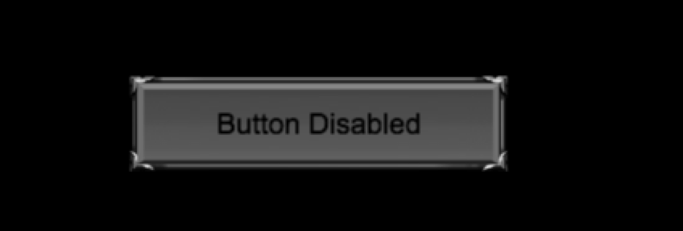
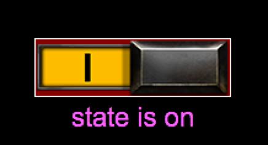
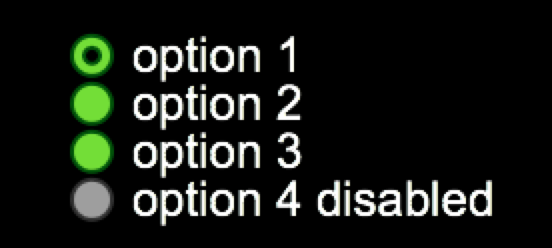

#Quick-Cocos2d-x UI控件之按钮(Button)控件

在Quick-Cocos2d-x之前的版本中使用的是菜单Menu，实现菜单的功能。在Quick-Cocos2d-x的v3.x版本中已经移除了菜单Menu，使用自己的封装Button实现菜单的功能。

按钮是一个项目中最基本的东西，因为你不论什么项目都缺少不了按钮。它是Quick中常见的UI控件。

## UIButton

按钮Button是基于Node的封装，可以创建带图片的按钮或文本标签的按钮，添加到层Layer上显示。就像普通按钮一样，我们可以很方便的处理按钮事件，按钮的状态。设置背景和显示文字。

> 注：UIButton不直接使用

### 按钮的种类

Quick中有三种Button控件，分别是`UIPushButton`(按钮控件)、`UICheckBoxButton`(CheckButton控件)和`UICheckBoxButtonGroup`(CheckButton组控件)。它们是Quick封装的按钮控件，
源码文件分别位于Quick目录的`/framework/cc/ui/`目录下`UIPushButton.lua/UICheckBoxButton.lua/UICheckBoxButtonGroup.lua`。

### 事件

Quick-Cocos2d-x中的按钮控件支持如下的事件：

* CLICKED  点击按钮 使用`UIButton:onButtonClicked(callback)`方法监听按钮的点击事件
* PRESSED  按下按钮 使用`UIButton:onButtonPressed(callback)`方法监听按钮的按下事件
* RELEASE  释放按钮 使用`UIButton:onButtonRelease(callback)`方法监听按钮的释放事件
* STATE_CHANGED  状态改变(enable <---> disable) 使用`UIButton:onButtonStateChanged(callback)`方法监听按钮的状态改变事件

Quick中的各种按钮控件都支持上面的事件。我们可以通过响应的方法监听并处理相应的事件。


##UIPushButton
UIPushButton就是我们常见的点击按下按钮，类似于常用的菜单。

`UIPushButton`是`UIButton`的子类，也是我们常用的Button。我们可以通过`cc.ui.UIPushButton`获取`UIPushButton`。

可以通过`cc.ui.UIPushButton.new(images, options)`方法创建一个按钮。

其中`images`是table类型，包含各个按钮状态下的图片。`options`为可选参数，table类型，包含是否scale9缩放，偏移flipX、flipY值等设置。

`UIPushButton`按钮的创建支持参数项为空的方式创建，然后在设置按钮各状态的图片，文字等。

**代码示例**：

下面代码创建了一个按钮，点击按钮触发相应的事件。

```
myButtonLayer.PUSH_BUTTON_IMAGES = {
    normal = "button/Button01.png",
    pressed = "button/Button01Pressed.png",
    disabled = "button/Button01Disabled.png",
}

function myButtonLayer:createUIPushButton()
    pushBtn = cc.ui.UIPushButton.new(myButtonLayer.PUSH_BUTTON_IMAGES, {scale9 = true})
        :setButtonSize(240, 60) --设置大小
        :setButtonLabel("normal", cc.ui.UILabel.new({
            UILabelType = 2,
            text = "This is a PushButton",
            size = 18
        }))-- 设置各个状态的按钮显示文字
        :setButtonLabel("pressed", cc.ui.UILabel.new({
            UILabelType = 2,
            text = "Button Pressed",
            size = 18,
            color = cc.c3b(255, 64, 64)
        }))
        :setButtonLabel("disabled", cc.ui.UILabel.new({
            UILabelType = 2,
            text = "Button Disabled",
            size = 18,
            color = cc.c3b(0, 0, 0)
        }))
        :onButtonClicked(function(event) -- 按钮的clicked事件处理
            print("pushButton click")
        end)
        :align(display.LEFT_CENTER, display.left + 80, display.top - 80) --设置位置 锚点位置和坐标x,y
        :addTo(self)   
end
```

上面代码使用三种按钮状态图片创建了一个UIPushButton类型的按钮，并设置了大小和显示文本标签。并通过`onButtonClicked`方法监听按钮的点击事件。

运行结果如图：




##UICheckBoxButton

UICheckBoxButton按钮可以用于制作单选框，状态切换按钮。

`UICheckBoxButton`同样是UIButton的子类，是常用的Check按钮。我们可以通过`cc.ui.UICheckBoxButton`获取UICheckBoxButton。

可以通过`cc.ui.UICheckBoxButton.new(images, options)`方法创建，其中`images`是table类型，包含各个按钮状态下的图片。`options`为可选参数，table类型，包含是否scale9缩放，偏移flipX、flipY值等设置。

`UICheckBoxButton`创建时需要指定按钮各个状态的图片，创建完成后同样可以通过`setButtonLabel`设置显示文本

**代码示例**：

下面代码创建了一个checkbutton按钮，点击按钮切换开关状态。

```
myButtonLayer.CHECKBOX_BUTTON_IMAGES = {
    off = "button/CheckBoxButtonOff.png",
    off_pressed = "button/CheckBoxButtonOffPressed.png",
    off_disabled = "button/CheckBoxButtonOffDisabled.png",
    on = "button/CheckBoxButtonOn.png",
    on_pressed = "button/CheckBoxButtonOnPressed.png",
    on_disabled = "button/CheckBoxButtonOnDisabled.png",
}

function myButtonLayer:createCheckButton()
    local function updateCheckBoxButtonLabel(checkbox)
        local state = ""
        if checkbox:isButtonSelected() then
            state = "on"
            pushBtn:setButtonEnabled(true) -- 禁用按钮
        else
            state = "off"
            pushBtn:setButtonEnabled(false) -- 禁用按钮
        end
        if not checkbox:isButtonEnabled() then
            state = state .. " (disabled)"
        end
        checkbox:setButtonLabelString(string.format("state is %s", state))
    end

   local checkBoxButton1 = cc.ui.UICheckBoxButton.new(myButtonLayer.CHECKBOX_BUTTON_IMAGES)
        :setButtonLabel(cc.ui.UILabel.new({text = "", size = 22,  color = cc.c3b(255, 96, 255)}))
        :setButtonLabelOffset(0, -40) --设置文本显示的偏移位置
        :setButtonLabelAlignment(display.CENTER) --设置文本对齐方式
        :onButtonStateChanged(function(event) --处理按钮状态变化
            updateCheckBoxButtonLabel(event.target)
        end)
        :align(display.LEFT_CENTER, display.left + 40, display.top - 180)--设置锚点和位置
        :addTo(self)
    updateCheckBoxButtonLabel(checkBoxButton1)
end
```
上面代码使用on/off各种状态的图片创建了一个UICheckBoxButton类型的开关按钮。通过按钮的状态改变监听方法`onButtonStateChanged`处理按钮的状态改变，实现了一个开关按钮。

运行结果如图：





##UICheckBoxButtonGroup
`UICheckBoxButtonGroup`是UICheckBoxButton组控件。用来创建类似radioButton。我们可以通过`cc.ui.UICheckBoxButtonGroup`获取`UICheckBoxButtonGroup`。

我们可以通过`cc.ui.UICheckBoxButtonGroup.new(direction)`方法创建UICheckBoxButton组控件。其中direction为integer类型，表示checkBox排列方向(可选的值有`display.LEFT_TO_RIGHT/display.RIGHT_TO_LEFT/display.TOP_TO_BOTTOM/display.BOTTOM_TO_TOP`)。创建完成后，可以使用`addButton`方法添加按钮，`removeButtonAtIndex(index)`移除指定index的按钮。

>注：CheckBoxButton组控件，类似RadioButton.同一时刻只能有一个被选中

**代码示例：**

```
myButtonLayer.RADIO_BUTTON_IMAGES = {
    off = "button/RadioButtonOff.png",
    off_pressed = "button/RadioButtonOffPressed.png",
    off_disabled = "button/RadioButtonOffDisabled.png",
    on = "button/RadioButtonOn.png",
    on_pressed = "button/RadioButtonOnPressed.png",
    on_disabled = "button/RadioButtonOnDisabled.png",
}

function myButtonLayer:createCheckBoxButtonGroup()

    local group = cc.ui.UICheckBoxButtonGroup.new(display.TOP_TO_BOTTOM) --创建checkButton组件
        :addButton(cc.ui.UICheckBoxButton.new(myButtonLayer.RADIO_BUTTON_IMAGES)
            :setButtonLabel(cc.ui.UILabel.new({text = "option 1", color = display.COLOR_WHITE}))
            :setButtonLabelOffset(20, 0)
            :align(display.LEFT_CENTER)) -- 添加checkButton
        :addButton(cc.ui.UICheckBoxButton.new(myButtonLayer.RADIO_BUTTON_IMAGES)
            :setButtonLabel(cc.ui.UILabel.new({text = "option 2", color = display.COLOR_WHITE}))
            :setButtonLabelOffset(20, 0)
            :align(display.LEFT_CENTER))
        :addButton(cc.ui.UICheckBoxButton.new(myButtonLayer.RADIO_BUTTON_IMAGES)
            :setButtonLabel(cc.ui.UILabel.new({text = "option 3", color = display.COLOR_WHITE}))
            :setButtonLabelOffset(20, 0)
            :align(display.LEFT_CENTER))
        :addButton(cc.ui.UICheckBoxButton.new(myButtonLayer.RADIO_BUTTON_IMAGES)
            :setButtonLabel(cc.ui.UILabel.new({text = "option 4 disabled", color = display.COLOR_WHITE}))
            :setButtonEnabled(false)
            :setButtonLabelOffset(20, 0)
            :align(display.LEFT_CENTER))
        :setButtonsLayoutMargin(10, 10, 10, 10) -- 设置Margin边缘值
        :onButtonSelectChanged(function(event)
            printf("Option %d selected, Option %d unselected", event.selected, event.last)
        end) -- 处理checkButton的选中事件
        :align(display.LEFT_CENTER, display.left + 40, display.top - 440) -- 设置锚点和位置
        :addTo(self)
    group:getButtonAtIndex(4):setButtonSelected(true) --获取指定index的按钮并设置选中
    
end
```

上面代码创建了一个checkbutton组控件，点击相应的按钮进行选中

运行结果如图：




## 相关源码及资源下载

[源码及资源下载](./code/code.zip)


